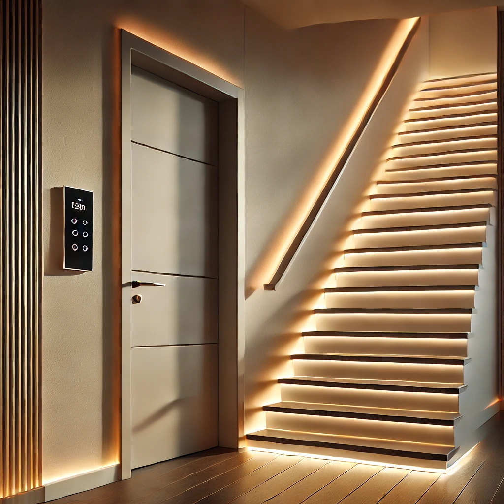
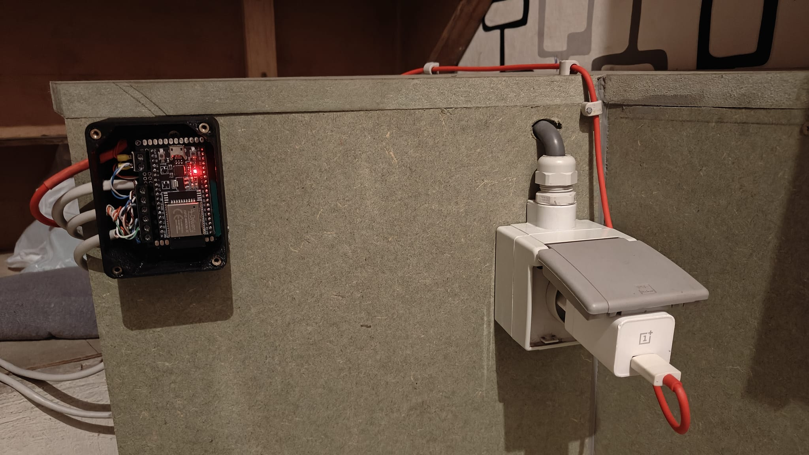

# Smart Staircase Lighting

# LED Staircase Automation

Illuminate your staircase intelligently with this project, which uses an ESP32, two PIR sensors, and a WS2812B LED strip to create an animation. Lights turn on automatically as you ascend or descend the stairs, providing safety and a modern aesthetic.

## Features
- **Automatic Detection**: Two PIR sensors detect motion at the top and bottom of the stairs.
- **Direction-Based Lighting**: LED animations follow the user's direction (ascending or descending).
- **Energy Efficient**: Lights fade off automatically after a set time period.
- **Customizable**: Adjust colors, brightness, and animation settings.
- **Compact and Low-Cost Design**: Minimal hardware requirements.

## Hardware Requirements
- 1x ESP32 Development Board
- 2x PIR AM312 Motion Sensors
- 1x WS2812B LED Strip (length depends on the staircase)
- 1x 5V Power Supply (current draw depends on the color and length of the LED strip)
- Prototyping board

## Software Requirements
- Arduino IDE
- FastLED library (for WS2812B control)
- ESPAsyncWebServer library (optional, for Wi-Fi controls) (not integrated yet)

## Wiring Diagram
You can find the wiring diagram [here](./diagram/), this folder includes a pdf and schematic file for Altium designer. 

## 3D Files
The project's control system is mounted beneath the staircase. To accommodate this setup, I designed a wall-mounted enclosure with openings for sensor and power supply cables, along with slotted mounting holes for precise alignment. You can find the 3D files [here](./fusionFiles/).

## Code
This code is made for a LED strip containing 300 LED's, modify the code to your needs. The code can be found [here](./code/)

## Prototype

The images show the final installment of the project. It was made using a prototyping board. The sensors are wired using ethernet cables. More images can be found [here](./images/)

[These](./video/) videos show the concept op this project.